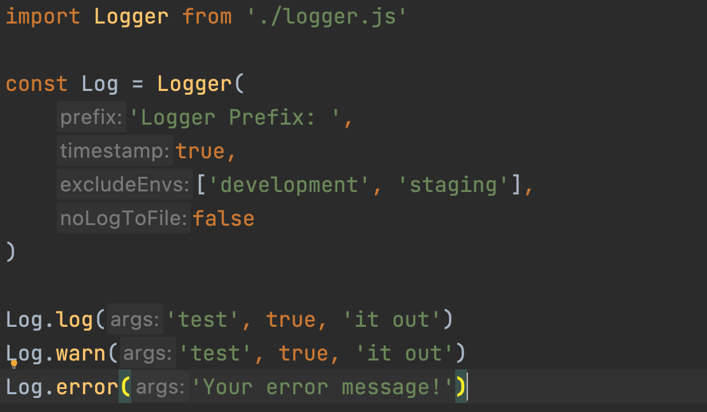
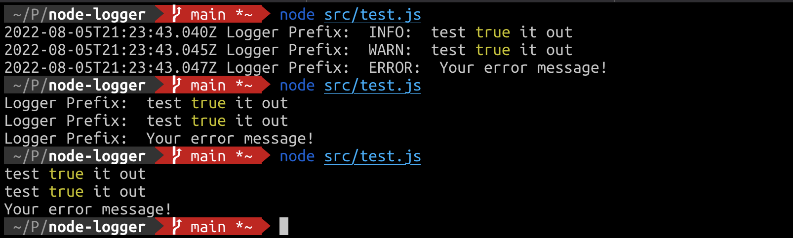

# node-logger

A simple Node.js logger.

This module is essentially a wrapper around the `console.log` and `console.error` methods that provides for a small amount of prescribed convenience regarding formatting, allowing for logging to the standard output as well as a series of text files within a `logs` directory.

## Usage

* The only distinction between the `log`, `warn`, and `error` methods is the output log file that is written to in the `logs/` directory.
* You can disable the prepended prefix by passing an empty string (`''`) to `Logger`
* You can disable the prepended timestamp by passing `false` as the second argument to `Logger`
* You can disable the writing of log files in specific environments by including an array of environments of which should be excluded as the third argument
* You can disable the writing of log files completely by passing `true` as the fourth argument



```javascript
import Logger from './logger.js'

const Log = Logger(
    'Logger Prefix: ',
    true,
    ['development', 'staging'],
    false
)

Log.log('test', true, 'it out')
Log.warn('test', true, 'it out')
Log.error('Your error message!')
```


## Testing

To run tests in your local environment:

    npm run test